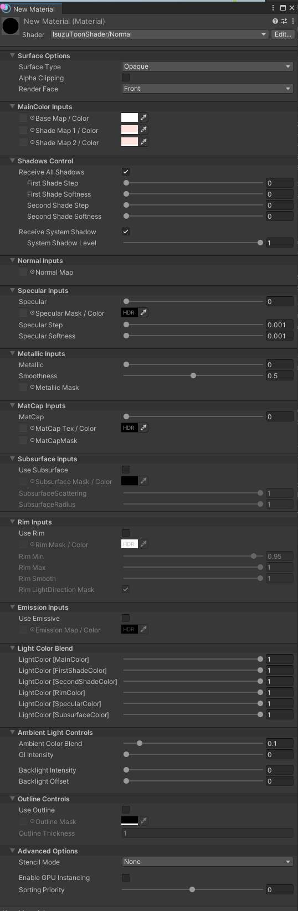

# IsuzuToonShaderURP
URP Toon Shader and PostProcessEffect

## Installation

Open ```Packages/manifest.json``` and add this.

```json
"dependencies": {
    "jp.shiranui-isuzu.toon-shader": "https://github.com/isuzu-shiranui/IsuzuToonShaderURP.git",
}
```

### Features


* alpha support
* 2 step shadow
* self shadow (experimental)
* normal map
* specular
* metallic
* matcap
* subsurface scattering
* rim light
* emission
* ambient color blend
* backlight
* outline 
* stencil